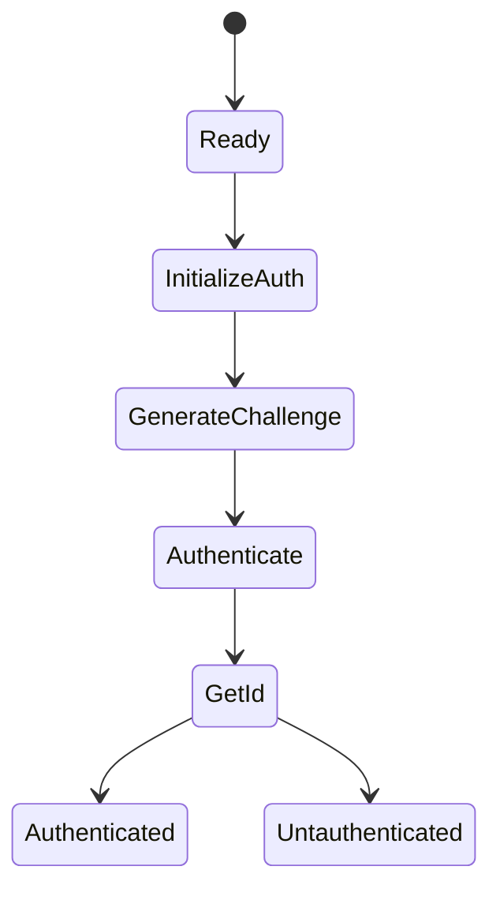
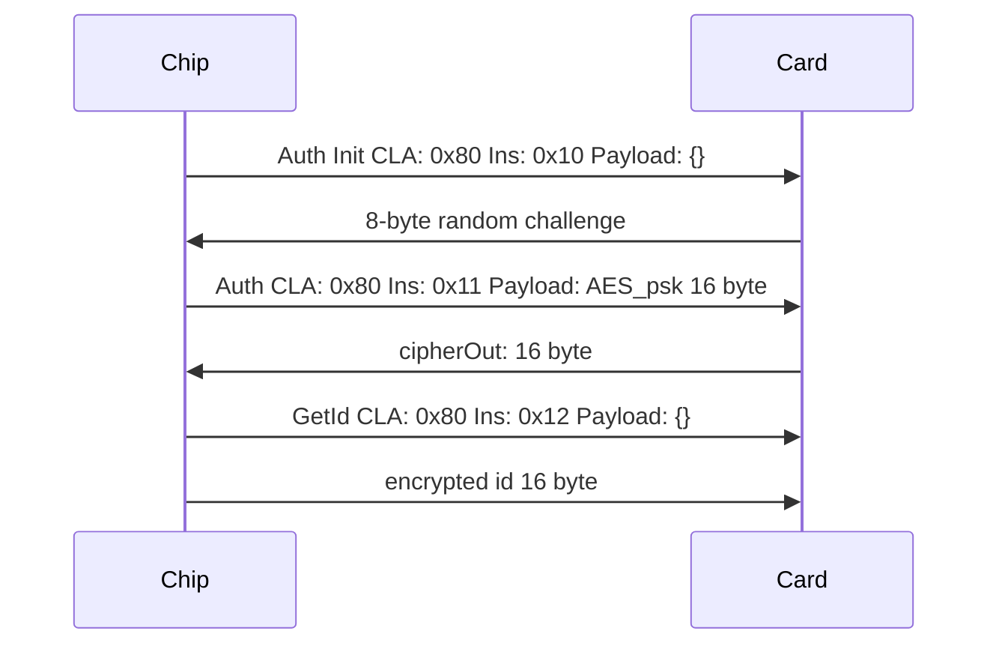

```mermaid
stateDiagram
    [*] --> Ready
    Ready --> InitializeAuth
    InitializeAuth --> GenerateChallenge
    GenerateChallenge --> Authenticate
    Authenticate --> GetId
    GetId --> Authenticated
    GetId --> Untauthenticated
```

# Sequence

```mermaid
sequenceDiagram
    Chip->>Card: Auth Init CLA: 0x80 Ins: 0x10 Payload: {}
    Card->>Chip: 8-byte random challenge
    Chip->>Card: Auth CLA: 0x80 Ins: 0x11 Payload: AES_psk 16 byte
    Card->>Chip: cipherOut: 16 byte
    Chip->>Card: GetId CLA: 0x80 Ins: 0x12 Payload: {}
    Chip->>Card: encrypted id 16 byte
```

